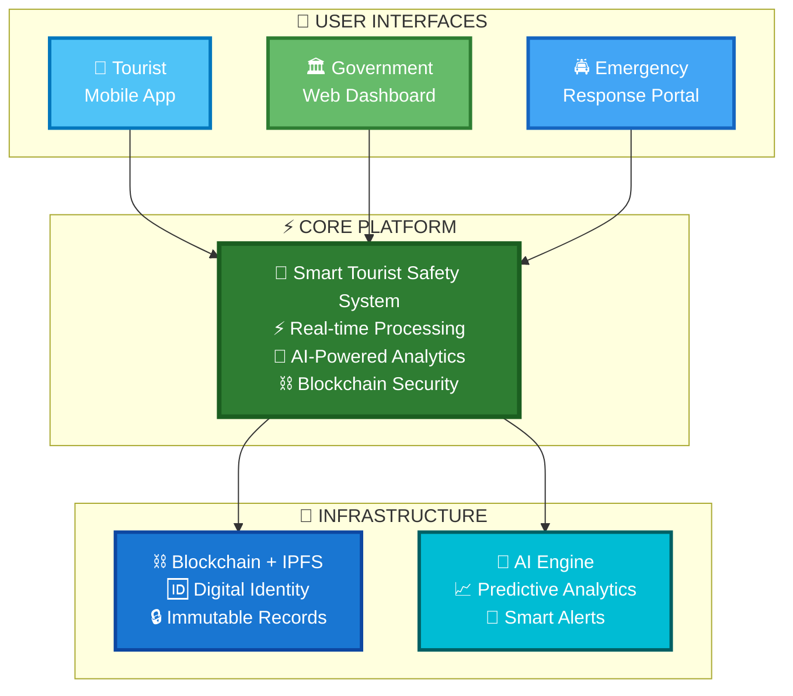
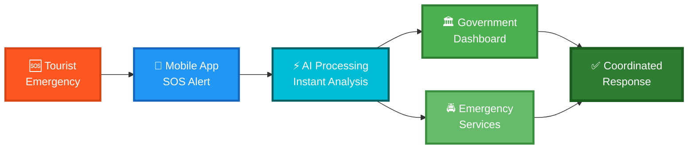
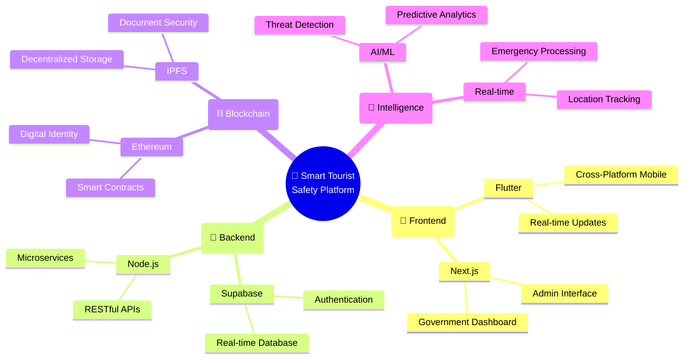
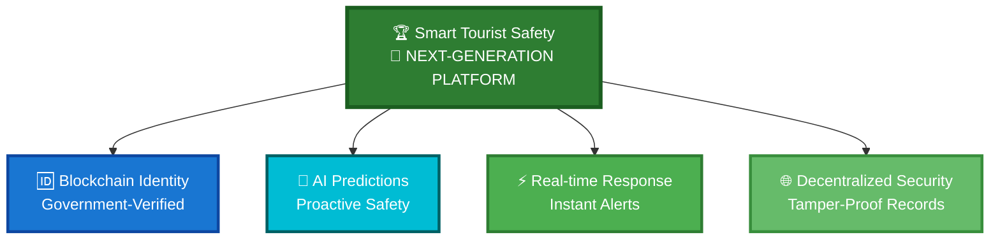
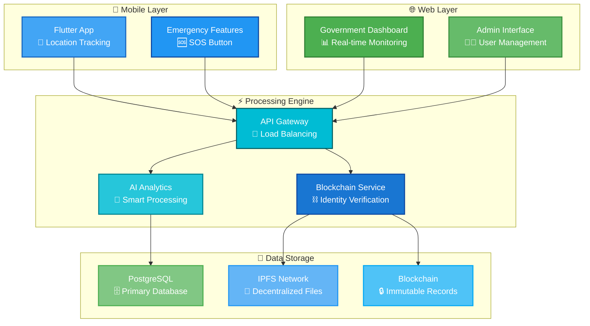
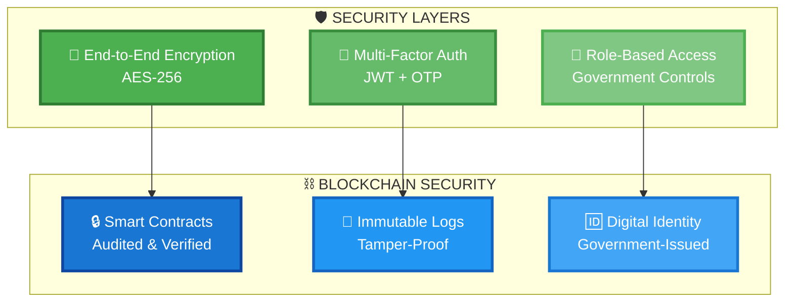
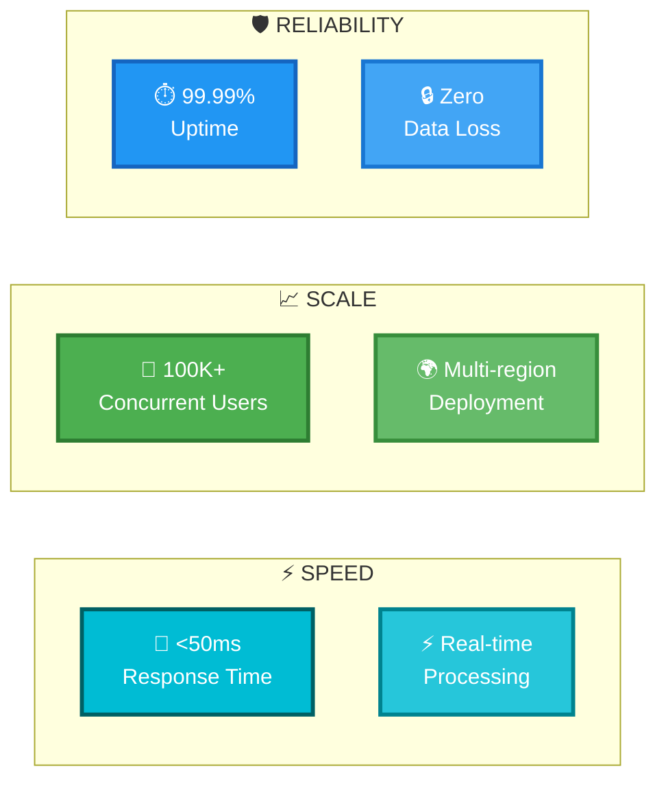

# 🏗️ Smart Tourist Safety System - Architecture Documentation

## 🌟 Executive Summary

The **Smart Tourist Safety System** is a cutting-edge platform integrating **real-time emergency response**, **blockchain digital identity**, **AI analytics**, and **cross-platform applications** for comprehensive tourist safety management.

---

## 🎯 System Architecture (PPT-Ready)

---

## 🚨 Emergency Response Workflow

---

## 🏆 Technology Stack

---

## 💫 Key Innovations

---

## 🔄 Data Flow Architecture

---

## 🔐 Security Architecture

---

## 📊 Performance Metrics

---

## 🚀 Deployment Pipeline

---

## 🎯 Perfect for Hackathon Presentations

### 📋 **PPT Slide Recommendations:**

1. **🎯 Slide 1**: System Architecture - Shows complete solution overview
2. **🚨 Slide 2**: Emergency Workflow - Demonstrates core functionality  
3. **🏆 Slide 3**: Key Innovations - Highlights unique features
4. **📊 Slide 4**: Performance Metrics - Shows scalability & reliability
5. **🔐 Slide 5**: Security Architecture - Emphasizes trust & safety

### 🎨 **Design Features:**
- **🌈 Clean green & blue color palette** - Professional and calming
- **📱 Simplified flows** - Easy judge comprehension
- **💫 Compact layouts** - Maximum impact, minimum clutter
- **⚡ Quick scanning** - Key points visible instantly

### 🏆 **Judge Impact Points:**
- **🥇 GOVERNMENT-VERIFIED**: Blockchain digital identity system
- **⚡ LIGHTNING-FAST**: Sub-50ms emergency response processing
- **🤖 AI-POWERED**: Predictive threat detection and analysis
- **🌐 ENTERPRISE-SCALE**: 100K+ concurrent user support
- **🔒 MILITARY-GRADE**: End-to-end encryption and security

---

**🏆 Smart Tourist Safety System - SIH 2025**  
*Next-Generation Tourist Safety with Blockchain, AI & Real-time Response* ✨