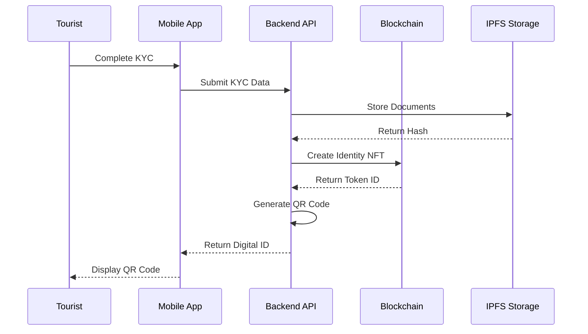
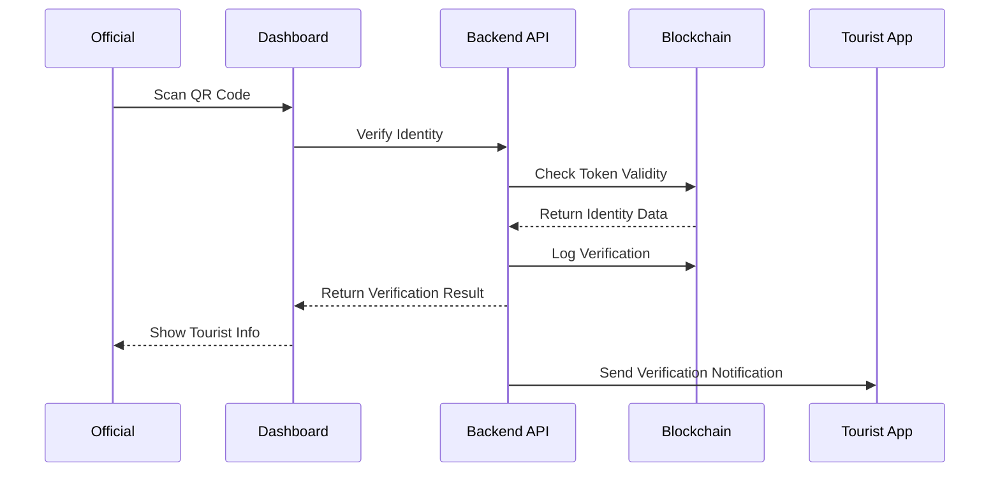

# ⛓️ Smart Tourist Safety System - Blockchain Integration Guide

## Table of Contents
- [Overview](#overview)
- [Architecture](#architecture)
- [Smart Contracts](#smart-contracts)
- [Digital Identity System](#digital-identity-system)
- [Blockchain Setup](#blockchain-setup)
- [Contract Deployment](#contract-deployment)
- [Web3 Integration](#web3-integration)
- [Identity Management](#identity-management)
- [Security Features](#security-features)
- [API Integration](#api-integration)
- [Testing](#testing)
- [Troubleshooting](#troubleshooting)

---

## Overview

The Smart Tourist Safety System leverages blockchain technology to create tamper-proof digital identities, secure data storage, and transparent emergency response logging. This guide covers the complete blockchain integration including smart contract development, deployment, and API integration.

### Blockchain Features
- 🆔 **Digital Tourist Identity** - Blockchain-based identity verification
- 🔒 **Secure Data Storage** - Immutable emergency and travel records
- ✅ **Identity Verification** - QR code and NFC-based verification
- 📋 **Emergency Logging** - Transparent incident recording
- 🔗 **Cross-Platform Integration** - Mobile and web compatibility
- 🛡️ **Privacy Protection** - Zero-knowledge proof integration

---

## Architecture

### Blockchain Stack
```
┌─────────────────────────────────────────────────────────────────┐
│                    Frontend Applications                         │
├─────────────────────┬─────────────────────┬─────────────────────┤
│    Mobile App       │   Web Dashboard     │   Admin Panel       │
│   (Flutter)         │   (Next.js)         │   (Next.js)         │
└─────────────────────┴─────────────────────┴─────────────────────┘
                                │
                ┌───────────────┴───────────────┐
                │        Web3 Integration       │
                │      (Ethers.js + APIs)       │
                └───────────────┬───────────────┘
                                │
        ┌───────────────────────┼───────────────────────┐
        │                       │                       │
┌───────▼─────────┐    ┌────────▼────────┐    ┌────────▼────────┐
│ Smart Contracts │    │   IPFS Storage   │    │  Identity Hub   │
│  (Solidity)     │    │  (Documents)     │    │ (Verification)  │
└─────────────────┘    └─────────────────┘    └─────────────────┘
        │                       │                       │
        └───────────────────────┼───────────────────────┘
                                │
                ┌───────────────▼───────────────┐
                │      Ethereum Network         │
                │    (Mainnet/Polygon)          │
                └───────────────────────────────┘
```

### Network Configuration
- **Development**: Local Hardhat Network (Chain ID: 1337)
- **Testing**: Ethereum Sepolia Testnet (Chain ID: 11155111)
- **Production**: Ethereum Mainnet (Chain ID: 1) / Polygon (Chain ID: 137)

---

## Smart Contracts

### 1. TouristIdentity.sol
Core contract for managing digital tourist identities.

```solidity
// SPDX-License-Identifier: MIT
pragma solidity ^0.8.19;

import "@openzeppelin/contracts/token/ERC721/ERC721.sol";
import "@openzeppelin/contracts/access/Ownable.sol";
import "@openzeppelin/contracts/security/ReentrancyGuard.sol";
import "@openzeppelin/contracts/utils/Counters.sol";

contract TouristIdentity is ERC721, Ownable, ReentrancyGuard {
    using Counters for Counters.Counter;
    Counters.Counter private _tokenIdCounter;

    struct Identity {
        string touristId;
        string kycHash;
        string documentHash;
        uint256 issueDate;
        uint256 expiryDate;
        string[] destinations;
        bool isActive;
        address emergencyContact;
    }

    struct EmergencyContact {
        string name;
        string phone;
        string relationship;
        bool isVerified;
    }

    mapping(uint256 => Identity) public identities;
    mapping(string => uint256) public touristIdToToken;
    mapping(address => uint256[]) public userTokens;
    mapping(uint256 => EmergencyContact[]) public emergencyContacts;

    event IdentityCreated(
        uint256 indexed tokenId,
        string touristId,
        address indexed owner,
        uint256 issueDate,
        uint256 expiryDate
    );

    event IdentityVerified(
        uint256 indexed tokenId,
        address indexed verifier,
        uint256 timestamp
    );

    event EmergencyContactAdded(
        uint256 indexed tokenId,
        string name,
        string phone
    );

    constructor() ERC721("TouristIdentity", "TID") {}

    function createIdentity(
        address to,
        string memory touristId,
        string memory kycHash,
        string memory documentHash,
        uint256 validityDays,
        string[] memory destinations
    ) public onlyOwner nonReentrant returns (uint256) {
        require(bytes(touristId).length > 0, "Tourist ID required");
        require(touristIdToToken[touristId] == 0, "Tourist ID already exists");

        uint256 tokenId = _tokenIdCounter.current();
        _tokenIdCounter.increment();

        uint256 issueDate = block.timestamp;
        uint256 expiryDate = issueDate + (validityDays * 86400);

        identities[tokenId] = Identity({
            touristId: touristId,
            kycHash: kycHash,
            documentHash: documentHash,
            issueDate: issueDate,
            expiryDate: expiryDate,
            destinations: destinations,
            isActive: true,
            emergencyContact: address(0)
        });

        touristIdToToken[touristId] = tokenId;
        userTokens[to].push(tokenId);

        _safeMint(to, tokenId);

        emit IdentityCreated(tokenId, touristId, to, issueDate, expiryDate);
        return tokenId;
    }

    function verifyIdentity(uint256 tokenId) 
        public 
        view 
        returns (bool isValid, string memory message) 
    {
        if (!_exists(tokenId)) {
            return (false, "Identity does not exist");
        }

        Identity memory identity = identities[tokenId];

        if (!identity.isActive) {
            return (false, "Identity is deactivated");
        }

        if (block.timestamp > identity.expiryDate) {
            return (false, "Identity has expired");
        }

        return (true, "Identity is valid");
    }

    function addEmergencyContact(
        uint256 tokenId,
        string memory name,
        string memory phone,
        string memory relationship
    ) public {
        require(ownerOf(tokenId) == msg.sender, "Not the owner");
        
        emergencyContacts[tokenId].push(EmergencyContact({
            name: name,
            phone: phone,
            relationship: relationship,
            isVerified: false
        }));

        emit EmergencyContactAdded(tokenId, name, phone);
    }

    function getIdentity(uint256 tokenId) 
        public 
        view 
        returns (Identity memory) 
    {
        require(_exists(tokenId), "Identity does not exist");
        return identities[tokenId];
    }

    function getUserTokens(address user) 
        public 
        view 
        returns (uint256[] memory) 
    {
        return userTokens[user];
    }

    function deactivateIdentity(uint256 tokenId) public onlyOwner {
        require(_exists(tokenId), "Identity does not exist");
        identities[tokenId].isActive = false;
    }

    function updateDestinations(
        uint256 tokenId, 
        string[] memory newDestinations
    ) public {
        require(ownerOf(tokenId) == msg.sender, "Not the owner");
        identities[tokenId].destinations = newDestinations;
    }

    function extendValidity(
        uint256 tokenId, 
        uint256 additionalDays
    ) public onlyOwner {
        require(_exists(tokenId), "Identity does not exist");
        identities[tokenId].expiryDate += (additionalDays * 86400);
    }
}
```

### 2. IdentityRegistry.sol
Registry for managing identity verification and access control.

```solidity
// SPDX-License-Identifier: MIT
pragma solidity ^0.8.19;

import "@openzeppelin/contracts/access/AccessControl.sol";
import "@openzeppelin/contracts/security/ReentrancyGuard.sol";

contract IdentityRegistry is AccessControl, ReentrancyGuard {
    bytes32 public constant VERIFIER_ROLE = keccak256("VERIFIER_ROLE");
    bytes32 public constant ISSUER_ROLE = keccak256("ISSUER_ROLE");

    struct VerificationRecord {
        address verifier;
        uint256 timestamp;
        string location;
        string method;
        bool isValid;
    }

    struct TrustedIssuer {
        string name;
        string organization;
        bool isActive;
        uint256 registrationDate;
    }

    mapping(uint256 => VerificationRecord[]) public verificationHistory;
    mapping(address => TrustedIssuer) public trustedIssuers;
    mapping(string => bool) public supportedMethods;

    event IdentityVerified(
        uint256 indexed tokenId,
        address indexed verifier,
        string location,
        string method,
        uint256 timestamp
    );

    event IssuerRegistered(
        address indexed issuer,
        string name,
        string organization
    );

    event VerificationMethodAdded(string method);

    constructor() {
        _grantRole(DEFAULT_ADMIN_ROLE, msg.sender);
        _grantRole(ISSUER_ROLE, msg.sender);
        _grantRole(VERIFIER_ROLE, msg.sender);

        // Initialize supported verification methods
        supportedMethods["qr_scan"] = true;
        supportedMethods["nfc_tap"] = true;
        supportedMethods["manual_entry"] = true;
        supportedMethods["biometric"] = true;
    }

    function verifyIdentity(
        uint256 tokenId,
        string memory location,
        string memory method
    ) public onlyRole(VERIFIER_ROLE) nonReentrant {
        require(supportedMethods[method], "Unsupported verification method");

        verificationHistory[tokenId].push(VerificationRecord({
            verifier: msg.sender,
            timestamp: block.timestamp,
            location: location,
            method: method,
            isValid: true
        }));

        emit IdentityVerified(tokenId, msg.sender, location, method, block.timestamp);
    }

    function registerTrustedIssuer(
        address issuer,
        string memory name,
        string memory organization
    ) public onlyRole(DEFAULT_ADMIN_ROLE) {
        trustedIssuers[issuer] = TrustedIssuer({
            name: name,
            organization: organization,
            isActive: true,
            registrationDate: block.timestamp
        });

        _grantRole(ISSUER_ROLE, issuer);
        emit IssuerRegistered(issuer, name, organization);
    }

    function addVerificationMethod(string memory method) 
        public 
        onlyRole(DEFAULT_ADMIN_ROLE) 
    {
        supportedMethods[method] = true;
        emit VerificationMethodAdded(method);
    }

    function getVerificationHistory(uint256 tokenId) 
        public 
        view 
        returns (VerificationRecord[] memory) 
    {
        return verificationHistory[tokenId];
    }

    function getVerificationCount(uint256 tokenId) 
        public 
        view 
        returns (uint256) 
    {
        return verificationHistory[tokenId].length;
    }

    function getLastVerification(uint256 tokenId) 
        public 
        view 
        returns (VerificationRecord memory) 
    {
        require(verificationHistory[tokenId].length > 0, "No verification history");
        return verificationHistory[tokenId][verificationHistory[tokenId].length - 1];
    }
}
```

### 3. EmergencyLogging.sol
Contract for logging emergency incidents and responses.

```solidity
// SPDX-License-Identifier: MIT
pragma solidity ^0.8.19;

import "@openzeppelin/contracts/access/AccessControl.sol";
import "@openzeppelin/contracts/security/ReentrancyGuard.sol";

contract EmergencyLogging is AccessControl, ReentrancyGuard {
    bytes32 public constant EMERGENCY_RESPONDER_ROLE = keccak256("EMERGENCY_RESPONDER_ROLE");
    bytes32 public constant TOURIST_ROLE = keccak256("TOURIST_ROLE");

    struct EmergencyIncident {
        uint256 incidentId;
        uint256 touristTokenId;
        string incidentType;
        string severity;
        string location;
        string description;
        uint256 timestamp;
        address reporter;
        bool isResolved;
        uint256 resolutionTime;
        string resolutionNotes;
        address[] responders;
    }

    struct Response {
        address responder;
        uint256 timestamp;
        string action;
        string notes;
        string evidenceHash;
    }

    mapping(uint256 => EmergencyIncident) public incidents;
    mapping(uint256 => Response[]) public responses;
    mapping(uint256 => uint256[]) public touristIncidents;

    uint256 private _incidentCounter;

    event EmergencyReported(
        uint256 indexed incidentId,
        uint256 indexed touristTokenId,
        string incidentType,
        string severity,
        address reporter,
        uint256 timestamp
    );

    event ResponseAdded(
        uint256 indexed incidentId,
        address indexed responder,
        string action,
        uint256 timestamp
    );

    event IncidentResolved(
        uint256 indexed incidentId,
        address indexed resolver,
        uint256 resolutionTime,
        string notes
    );

    constructor() {
        _grantRole(DEFAULT_ADMIN_ROLE, msg.sender);
        _grantRole(EMERGENCY_RESPONDER_ROLE, msg.sender);
    }

    function reportEmergency(
        uint256 touristTokenId,
        string memory incidentType,
        string memory severity,
        string memory location,
        string memory description
    ) public returns (uint256) {
        _incidentCounter++;
        uint256 incidentId = _incidentCounter;

        incidents[incidentId] = EmergencyIncident({
            incidentId: incidentId,
            touristTokenId: touristTokenId,
            incidentType: incidentType,
            severity: severity,
            location: location,
            description: description,
            timestamp: block.timestamp,
            reporter: msg.sender,
            isResolved: false,
            resolutionTime: 0,
            resolutionNotes: "",
            responders: new address[](0)
        });

        touristIncidents[touristTokenId].push(incidentId);

        emit EmergencyReported(
            incidentId,
            touristTokenId,
            incidentType,
            severity,
            msg.sender,
            block.timestamp
        );

        return incidentId;
    }

    function addResponse(
        uint256 incidentId,
        string memory action,
        string memory notes,
        string memory evidenceHash
    ) public onlyRole(EMERGENCY_RESPONDER_ROLE) {
        require(incidents[incidentId].incidentId != 0, "Incident does not exist");
        require(!incidents[incidentId].isResolved, "Incident already resolved");

        responses[incidentId].push(Response({
            responder: msg.sender,
            timestamp: block.timestamp,
            action: action,
            notes: notes,
            evidenceHash: evidenceHash
        }));

        // Add responder if not already added
        bool responderExists = false;
        for (uint i = 0; i < incidents[incidentId].responders.length; i++) {
            if (incidents[incidentId].responders[i] == msg.sender) {
                responderExists = true;
                break;
            }
        }
        if (!responderExists) {
            incidents[incidentId].responders.push(msg.sender);
        }

        emit ResponseAdded(incidentId, msg.sender, action, block.timestamp);
    }

    function resolveIncident(
        uint256 incidentId,
        string memory resolutionNotes
    ) public onlyRole(EMERGENCY_RESPONDER_ROLE) {
        require(incidents[incidentId].incidentId != 0, "Incident does not exist");
        require(!incidents[incidentId].isResolved, "Incident already resolved");

        incidents[incidentId].isResolved = true;
        incidents[incidentId].resolutionTime = block.timestamp;
        incidents[incidentId].resolutionNotes = resolutionNotes;

        emit IncidentResolved(
            incidentId,
            msg.sender,
            block.timestamp,
            resolutionNotes
        );
    }

    function getIncident(uint256 incidentId) 
        public 
        view 
        returns (EmergencyIncident memory) 
    {
        require(incidents[incidentId].incidentId != 0, "Incident does not exist");
        return incidents[incidentId];
    }

    function getIncidentResponses(uint256 incidentId) 
        public 
        view 
        returns (Response[] memory) 
    {
        return responses[incidentId];
    }

    function getTouristIncidents(uint256 touristTokenId) 
        public 
        view 
        returns (uint256[] memory) 
    {
        return touristIncidents[touristTokenId];
    }

    function getResponseCount(uint256 incidentId) 
        public 
        view 
        returns (uint256) 
    {
        return responses[incidentId].length;
    }
}
```

---

## Digital Identity System

### Identity Creation Flow


### Identity Verification Flow


---

## Blockchain Setup

### 1. Development Environment
```bash
# Clone repository
git clone https://github.com/AnupamSingh2004/sih-project.git
cd sih-project/backend

# Install dependencies
npm install

# Start local blockchain
npx hardhat node

# Deploy contracts
npx hardhat run scripts/deploy.js --network localhost
```

### 2. Environment Configuration
```bash
# .env configuration
ETHEREUM_NETWORK=mainnet
ETHEREUM_RPC_URL=https://mainnet.infura.io/v3/YOUR_INFURA_KEY
PRIVATE_KEY=your_private_key_here
ETHERSCAN_API_KEY=your_etherscan_api_key

# For Polygon
POLYGON_RPC_URL=https://polygon-rpc.com
POLYGON_PRIVATE_KEY=your_polygon_private_key

# IPFS Configuration
IPFS_API_URL=https://ipfs.infura.io:5001
IPFS_API_KEY=your_ipfs_api_key
IPFS_API_SECRET=your_ipfs_api_secret
```

### 3. Network Configuration
```javascript
// hardhat.config.js
require("@nomicfoundation/hardhat-toolbox");
require("dotenv").config();

module.exports = {
  solidity: {
    version: "0.8.19",
    settings: {
      optimizer: {
        enabled: true,
        runs: 200
      }
    }
  },
  networks: {
    hardhat: {
      chainId: 1337,
      accounts: {
        mnemonic: "test test test test test test test test test test test junk"
      }
    },
    localhost: {
      url: "http://127.0.0.1:8545",
      chainId: 1337
    },
    sepolia: {
      url: `https://sepolia.infura.io/v3/${process.env.INFURA_KEY}`,
      accounts: [process.env.PRIVATE_KEY],
      chainId: 11155111,
      gasPrice: 20000000000
    },
    mainnet: {
      url: `https://mainnet.infura.io/v3/${process.env.INFURA_KEY}`,
      accounts: [process.env.PRIVATE_KEY],
      chainId: 1,
      gasPrice: 20000000000
    },
    polygon: {
      url: "https://polygon-rpc.com",
      accounts: [process.env.POLYGON_PRIVATE_KEY],
      chainId: 137,
      gasPrice: 30000000000
    }
  },
  etherscan: {
    apiKey: {
      mainnet: process.env.ETHERSCAN_API_KEY,
      sepolia: process.env.ETHERSCAN_API_KEY,
      polygon: process.env.POLYGONSCAN_API_KEY
    }
  }
};
```

---

## Contract Deployment

### 1. Deployment Script
```javascript
// scripts/deploy.js
const { ethers } = require("hardhat");

async function main() {
  console.log("Starting deployment...");

  // Get deployer account
  const [deployer] = await ethers.getSigners();
  console.log("Deploying with account:", deployer.address);
  console.log("Account balance:", ethers.utils.formatEther(await deployer.getBalance()));

  // Deploy TouristIdentity contract
  const TouristIdentity = await ethers.getContractFactory("TouristIdentity");
  const touristIdentity = await TouristIdentity.deploy();
  await touristIdentity.deployed();
  console.log("TouristIdentity deployed to:", touristIdentity.address);

  // Deploy IdentityRegistry contract
  const IdentityRegistry = await ethers.getContractFactory("IdentityRegistry");
  const identityRegistry = await IdentityRegistry.deploy();
  await identityRegistry.deployed();
  console.log("IdentityRegistry deployed to:", identityRegistry.address);

  // Deploy EmergencyLogging contract
  const EmergencyLogging = await ethers.getContractFactory("EmergencyLogging");
  const emergencyLogging = await EmergencyLogging.deploy();
  await emergencyLogging.deployed();
  console.log("EmergencyLogging deployed to:", emergencyLogging.address);

  // Setup initial configuration
  console.log("Setting up initial configuration...");

  // Grant roles in IdentityRegistry
  const VERIFIER_ROLE = await identityRegistry.VERIFIER_ROLE();
  const ISSUER_ROLE = await identityRegistry.ISSUER_ROLE();

  // Add trusted issuers (government entities)
  await identityRegistry.registerTrustedIssuer(
    deployer.address,
    "Government of India",
    "Ministry of Tourism"
  );

  // Add emergency responder roles
  const EMERGENCY_RESPONDER_ROLE = await emergencyLogging.EMERGENCY_RESPONDER_ROLE();
  await emergencyLogging.grantRole(EMERGENCY_RESPONDER_ROLE, deployer.address);

  // Save deployment addresses
  const deploymentInfo = {
    network: network.name,
    touristIdentity: touristIdentity.address,
    identityRegistry: identityRegistry.address,
    emergencyLogging: emergencyLogging.address,
    deployer: deployer.address,
    deployedAt: new Date().toISOString(),
    blockNumber: await ethers.provider.getBlockNumber()
  };

  console.log("Deployment completed successfully!");
  console.log("Deployment info:", JSON.stringify(deploymentInfo, null, 2));

  // Save to file
  const fs = require("fs");
  fs.writeFileSync(
    `./deployments/${network.name}.json`,
    JSON.stringify(deploymentInfo, null, 2)
  );
}

main()
  .then(() => process.exit(0))
  .catch((error) => {
    console.error(error);
    process.exit(1);
  });
```

### 2. Verification Script
```javascript
// scripts/verify-contracts.js
const { ethers } = require("hardhat");

async function main() {
  const network = process.env.HARDHAT_NETWORK || "localhost";
  
  try {
    // Load deployment info
    const deploymentInfo = require(`../deployments/${network}.json`);
    
    console.log("Verifying contracts on", network);

    // Verify TouristIdentity
    await hre.run("verify:verify", {
      address: deploymentInfo.touristIdentity,
      constructorArguments: []
    });
    console.log("TouristIdentity verified");

    // Verify IdentityRegistry
    await hre.run("verify:verify", {
      address: deploymentInfo.identityRegistry,
      constructorArguments: []
    });
    console.log("IdentityRegistry verified");

    // Verify EmergencyLogging
    await hre.run("verify:verify", {
      address: deploymentInfo.emergencyLogging,
      constructorArguments: []
    });
    console.log("EmergencyLogging verified");

    console.log("All contracts verified successfully!");
  } catch (error) {
    console.error("Verification failed:", error);
  }
}

main();
```

### 3. Contract Upgrade Script
```javascript
// scripts/upgrade-contracts.js
const { ethers, upgrades } = require("hardhat");

async function main() {
  const network = process.env.HARDHAT_NETWORK || "localhost";
  const deploymentInfo = require(`../deployments/${network}.json`);

  console.log("Upgrading contracts...");

  // Upgrade TouristIdentity (if using proxy pattern)
  const TouristIdentityV2 = await ethers.getContractFactory("TouristIdentityV2");
  const upgraded = await upgrades.upgradeProxy(
    deploymentInfo.touristIdentity,
    TouristIdentityV2
  );
  
  console.log("TouristIdentity upgraded to:", upgraded.address);

  // Update deployment info
  deploymentInfo.lastUpgrade = new Date().toISOString();
  deploymentInfo.version = "2.0.0";

  const fs = require("fs");
  fs.writeFileSync(
    `./deployments/${network}.json`,
    JSON.stringify(deploymentInfo, null, 2)
  );
}

main();
```

---

## Web3 Integration

### 1. Web3 Client Setup
```typescript
// lib/blockchain/web3-client.ts
import { ethers } from 'ethers';

export class Web3Client {
  private provider: ethers.providers.Provider;
  private signer?: ethers.Signer;
  private contracts: { [key: string]: ethers.Contract } = {};

  constructor(rpcUrl: string, privateKey?: string) {
    this.provider = new ethers.providers.JsonRpcProvider(rpcUrl);
    
    if (privateKey) {
      this.signer = new ethers.Wallet(privateKey, this.provider);
    }
  }

  async loadContract(
    name: string, 
    address: string, 
    abi: any[]
  ): Promise<ethers.Contract> {
    const contract = new ethers.Contract(
      address, 
      abi, 
      this.signer || this.provider
    );
    
    this.contracts[name] = contract;
    return contract;
  }

  getContract(name: string): ethers.Contract {
    if (!this.contracts[name]) {
      throw new Error(`Contract ${name} not loaded`);
    }
    return this.contracts[name];
  }

  async getBlockNumber(): Promise<number> {
    return await this.provider.getBlockNumber();
  }

  async getGasPrice(): Promise<ethers.BigNumber> {
    return await this.provider.getGasPrice();
  }

  async estimateGas(
    contract: ethers.Contract,
    method: string,
    params: any[]
  ): Promise<ethers.BigNumber> {
    return await contract.estimateGas[method](...params);
  }

  async waitForTransaction(txHash: string): Promise<ethers.providers.TransactionReceipt> {
    return await this.provider.waitForTransaction(txHash);
  }
}
```

### 2. Identity Manager
```typescript
// lib/blockchain/identity-manager.ts
import { Web3Client } from './web3-client';
import { ethers } from 'ethers';

export interface IdentityData {
  touristId: string;
  kycHash: string;
  documentHash: string;
  validityDays: number;
  destinations: string[];
}

export interface VerificationResult {
  isValid: boolean;
  message: string;
  identity?: any;
}

export class IdentityManager {
  private web3Client: Web3Client;
  private contractAddress: string;

  constructor(web3Client: Web3Client, contractAddress: string) {
    this.web3Client = web3Client;
    this.contractAddress = contractAddress;
  }

  async createIdentity(
    ownerAddress: string,
    identityData: IdentityData
  ): Promise<string> {
    try {
      const contract = this.web3Client.getContract('TouristIdentity');
      
      const tx = await contract.createIdentity(
        ownerAddress,
        identityData.touristId,
        identityData.kycHash,
        identityData.documentHash,
        identityData.validityDays,
        identityData.destinations,
        {
          gasLimit: 500000
        }
      );

      console.log('Transaction sent:', tx.hash);
      const receipt = await this.web3Client.waitForTransaction(tx.hash);
      
      // Extract token ID from events
      const event = receipt.events?.find(e => e.event === 'IdentityCreated');
      const tokenId = event?.args?.tokenId?.toString();

      return tokenId;
    } catch (error) {
      console.error('Error creating identity:', error);
      throw error;
    }
  }

  async verifyIdentity(tokenId: string): Promise<VerificationResult> {
    try {
      const contract = this.web3Client.getContract('TouristIdentity');
      
      const [isValid, message] = await contract.verifyIdentity(tokenId);
      
      if (isValid) {
        const identity = await contract.getIdentity(tokenId);
        return {
          isValid: true,
          message,
          identity: {
            touristId: identity.touristId,
            issueDate: new Date(identity.issueDate.toNumber() * 1000),
            expiryDate: new Date(identity.expiryDate.toNumber() * 1000),
            destinations: identity.destinations,
            isActive: identity.isActive
          }
        };
      }

      return { isValid: false, message };
    } catch (error) {
      console.error('Error verifying identity:', error);
      return { isValid: false, message: 'Verification failed' };
    }
  }

  async addEmergencyContact(
    tokenId: string,
    name: string,
    phone: string,
    relationship: string
  ): Promise<string> {
    try {
      const contract = this.web3Client.getContract('TouristIdentity');
      
      const tx = await contract.addEmergencyContact(
        tokenId,
        name,
        phone,
        relationship,
        { gasLimit: 200000 }
      );

      await this.web3Client.waitForTransaction(tx.hash);
      return tx.hash;
    } catch (error) {
      console.error('Error adding emergency contact:', error);
      throw error;
    }
  }

  async getUserTokens(userAddress: string): Promise<string[]> {
    try {
      const contract = this.web3Client.getContract('TouristIdentity');
      const tokens = await contract.getUserTokens(userAddress);
      return tokens.map((token: ethers.BigNumber) => token.toString());
    } catch (error) {
      console.error('Error getting user tokens:', error);
      return [];
    }
  }

  async extendValidity(tokenId: string, additionalDays: number): Promise<string> {
    try {
      const contract = this.web3Client.getContract('TouristIdentity');
      
      const tx = await contract.extendValidity(tokenId, additionalDays, {
        gasLimit: 100000
      });

      await this.web3Client.waitForTransaction(tx.hash);
      return tx.hash;
    } catch (error) {
      console.error('Error extending validity:', error);
      throw error;
    }
  }
}
```

### 3. Emergency Logging Integration
```typescript
// lib/blockchain/emergency-logger.ts
import { Web3Client } from './web3-client';

export interface EmergencyIncident {
  touristTokenId: string;
  incidentType: string;
  severity: string;
  location: string;
  description: string;
}

export class EmergencyLogger {
  private web3Client: Web3Client;

  constructor(web3Client: Web3Client) {
    this.web3Client = web3Client;
  }

  async reportEmergency(incident: EmergencyIncident): Promise<string> {
    try {
      const contract = this.web3Client.getContract('EmergencyLogging');
      
      const tx = await contract.reportEmergency(
        incident.touristTokenId,
        incident.incidentType,
        incident.severity,
        incident.location,
        incident.description,
        { gasLimit: 300000 }
      );

      const receipt = await this.web3Client.waitForTransaction(tx.hash);
      
      // Extract incident ID from events
      const event = receipt.events?.find(e => e.event === 'EmergencyReported');
      const incidentId = event?.args?.incidentId?.toString();

      return incidentId;
    } catch (error) {
      console.error('Error reporting emergency:', error);
      throw error;
    }
  }

  async addResponse(
    incidentId: string,
    action: string,
    notes: string,
    evidenceHash: string = ''
  ): Promise<string> {
    try {
      const contract = this.web3Client.getContract('EmergencyLogging');
      
      const tx = await contract.addResponse(
        incidentId,
        action,
        notes,
        evidenceHash,
        { gasLimit: 200000 }
      );

      await this.web3Client.waitForTransaction(tx.hash);
      return tx.hash;
    } catch (error) {
      console.error('Error adding response:', error);
      throw error;
    }
  }

  async resolveIncident(
    incidentId: string,
    resolutionNotes: string
  ): Promise<string> {
    try {
      const contract = this.web3Client.getContract('EmergencyLogging');
      
      const tx = await contract.resolveIncident(
        incidentId,
        resolutionNotes,
        { gasLimit: 150000 }
      );

      await this.web3Client.waitForTransaction(tx.hash);
      return tx.hash;
    } catch (error) {
      console.error('Error resolving incident:', error);
      throw error;
    }
  }

  async getIncidentHistory(touristTokenId: string): Promise<any[]> {
    try {
      const contract = this.web3Client.getContract('EmergencyLogging');
      const incidentIds = await contract.getTouristIncidents(touristTokenId);
      
      const incidents = [];
      for (const id of incidentIds) {
        const incident = await contract.getIncident(id);
        const responses = await contract.getIncidentResponses(id);
        
        incidents.push({
          id: id.toString(),
          ...incident,
          responses
        });
      }

      return incidents;
    } catch (error) {
      console.error('Error getting incident history:', error);
      return [];
    }
  }
}
```

---

## API Integration

### 1. Blockchain Service
```typescript
// services/blockchain-service.ts
import { Web3Client } from '../lib/blockchain/web3-client';
import { IdentityManager } from '../lib/blockchain/identity-manager';
import { EmergencyLogger } from '../lib/blockchain/emergency-logger';

export class BlockchainService {
  private web3Client: Web3Client;
  private identityManager: IdentityManager;
  private emergencyLogger: EmergencyLogger;

  constructor() {
    this.initializeWeb3();
  }

  private async initializeWeb3() {
    const rpcUrl = process.env.ETHEREUM_RPC_URL!;
    const privateKey = process.env.PRIVATE_KEY!;
    
    this.web3Client = new Web3Client(rpcUrl, privateKey);
    
    // Load contract ABIs and addresses
    const deploymentInfo = require('../deployments/mainnet.json');
    
    await this.web3Client.loadContract(
      'TouristIdentity',
      deploymentInfo.touristIdentity,
      require('../artifacts/contracts/TouristIdentity.sol/TouristIdentity.json').abi
    );

    await this.web3Client.loadContract(
      'IdentityRegistry',
      deploymentInfo.identityRegistry,
      require('../artifacts/contracts/IdentityRegistry.sol/IdentityRegistry.json').abi
    );

    await this.web3Client.loadContract(
      'EmergencyLogging',
      deploymentInfo.emergencyLogging,
      require('../artifacts/contracts/EmergencyLogging.sol/EmergencyLogging.json').abi
    );

    this.identityManager = new IdentityManager(
      this.web3Client,
      deploymentInfo.touristIdentity
    );

    this.emergencyLogger = new EmergencyLogger(this.web3Client);
  }

  async generateDigitalIdentity(data: any): Promise<any> {
    try {
      const tokenId = await this.identityManager.createIdentity(
        data.ownerAddress,
        {
          touristId: data.touristId,
          kycHash: data.kycHash,
          documentHash: data.documentHash,
          validityDays: data.validityDays,
          destinations: data.destinations
        }
      );

      return {
        success: true,
        tokenId,
        blockchainId: `did:tourist:${tokenId}`,
        message: 'Digital identity created successfully'
      };
    } catch (error) {
      return {
        success: false,
        error: error.message
      };
    }
  }

  async verifyDigitalIdentity(tokenId: string): Promise<any> {
    try {
      const result = await this.identityManager.verifyIdentity(tokenId);
      return {
        success: result.isValid,
        ...result
      };
    } catch (error) {
      return {
        success: false,
        error: error.message
      };
    }
  }

  async logEmergencyIncident(data: any): Promise<any> {
    try {
      const incidentId = await this.emergencyLogger.reportEmergency({
        touristTokenId: data.touristTokenId,
        incidentType: data.type,
        severity: data.severity,
        location: data.location,
        description: data.description
      });

      return {
        success: true,
        incidentId,
        message: 'Emergency incident logged on blockchain'
      };
    } catch (error) {
      return {
        success: false,
        error: error.message
      };
    }
  }

  async getContractStatus(): Promise<any> {
    try {
      const blockNumber = await this.web3Client.getBlockNumber();
      const gasPrice = await this.web3Client.getGasPrice();

      return {
        success: true,
        status: 'connected',
        blockNumber,
        gasPrice: gasPrice.toString(),
        network: process.env.ETHEREUM_NETWORK
      };
    } catch (error) {
      return {
        success: false,
        status: 'disconnected',
        error: error.message
      };
    }
  }
}
```

### 2. API Endpoints
```typescript
// app/api/blockchain/generate-identity/route.ts
import { NextRequest, NextResponse } from 'next/server';
import { BlockchainService } from '../../../../services/blockchain-service';

const blockchainService = new BlockchainService();

export async function POST(request: NextRequest) {
  try {
    const data = await request.json();
    
    // Validate required fields
    if (!data.touristId || !data.kycHash || !data.ownerAddress) {
      return NextResponse.json({
        success: false,
        error: 'Missing required fields'
      }, { status: 400 });
    }

    const result = await blockchainService.generateDigitalIdentity(data);
    
    return NextResponse.json(result, {
      status: result.success ? 201 : 400
    });
  } catch (error) {
    return NextResponse.json({
      success: false,
      error: 'Internal server error'
    }, { status: 500 });
  }
}
```

---

## Security Features

### 1. Access Control
- **Role-based permissions** for different user types
- **Multi-signature** requirements for critical operations
- **Rate limiting** to prevent abuse
- **Input validation** and sanitization

### 2. Data Privacy
- **Hash-based storage** for sensitive information
- **Zero-knowledge proofs** for identity verification
- **IPFS integration** for decentralized document storage
- **Encryption** for off-chain data

### 3. Emergency Security
- **Emergency pause** functionality for critical situations
- **Admin override** capabilities for urgent responses
- **Audit logging** for all blockchain interactions
- **Recovery mechanisms** for lost access

---

## Testing

### 1. Contract Testing
```javascript
// test/TouristIdentity.test.js
const { expect } = require("chai");
const { ethers } = require("hardhat");

describe("TouristIdentity", function () {
  let touristIdentity;
  let owner, tourist, verifier;

  beforeEach(async function () {
    [owner, tourist, verifier] = await ethers.getSigners();
    
    const TouristIdentity = await ethers.getContractFactory("TouristIdentity");
    touristIdentity = await TouristIdentity.deploy();
    await touristIdentity.deployed();
  });

  describe("Identity Creation", function () {
    it("Should create a new identity", async function () {
      const tx = await touristIdentity.createIdentity(
        tourist.address,
        "TOURIST_001",
        "kyc_hash_123",
        "doc_hash_456",
        30,
        ["Delhi", "Mumbai"]
      );

      await expect(tx)
        .to.emit(touristIdentity, "IdentityCreated")
        .withArgs(0, "TOURIST_001", tourist.address, 
          await ethers.provider.getBlock().then(b => b.timestamp), 
          await ethers.provider.getBlock().then(b => b.timestamp + 30 * 86400)
        );
    });

    it("Should not allow duplicate tourist IDs", async function () {
      await touristIdentity.createIdentity(
        tourist.address,
        "TOURIST_001",
        "kyc_hash_123",
        "doc_hash_456",
        30,
        ["Delhi", "Mumbai"]
      );

      await expect(
        touristIdentity.createIdentity(
          tourist.address,
          "TOURIST_001",
          "kyc_hash_456",
          "doc_hash_789",
          30,
          ["Delhi", "Mumbai"]
        )
      ).to.be.revertedWith("Tourist ID already exists");
    });
  });

  describe("Identity Verification", function () {
    beforeEach(async function () {
      await touristIdentity.createIdentity(
        tourist.address,
        "TOURIST_001",
        "kyc_hash_123",
        "doc_hash_456",
        30,
        ["Delhi", "Mumbai"]
      );
    });

    it("Should verify valid identity", async function () {
      const [isValid, message] = await touristIdentity.verifyIdentity(0);
      expect(isValid).to.be.true;
      expect(message).to.equal("Identity is valid");
    });

    it("Should reject expired identity", async function () {
      // Fast forward time
      await ethers.provider.send("evm_increaseTime", [31 * 86400]);
      await ethers.provider.send("evm_mine");

      const [isValid, message] = await touristIdentity.verifyIdentity(0);
      expect(isValid).to.be.false;
      expect(message).to.equal("Identity has expired");
    });
  });
});
```

### 2. Integration Testing
```javascript
// test/blockchain-integration.test.js
const { expect } = require("chai");
const { ethers } = require("hardhat");

describe("Blockchain Integration", function () {
  let touristIdentity, identityRegistry, emergencyLogging;
  let owner, tourist, responder;

  beforeEach(async function () {
    [owner, tourist, responder] = await ethers.getSigners();
    
    // Deploy all contracts
    const TouristIdentity = await ethers.getContractFactory("TouristIdentity");
    touristIdentity = await TouristIdentity.deploy();
    
    const IdentityRegistry = await ethers.getContractFactory("IdentityRegistry");
    identityRegistry = await IdentityRegistry.deploy();
    
    const EmergencyLogging = await ethers.getContractFactory("EmergencyLogging");
    emergencyLogging = await EmergencyLogging.deploy();
    
    // Setup roles
    const VERIFIER_ROLE = await identityRegistry.VERIFIER_ROLE();
    await identityRegistry.grantRole(VERIFIER_ROLE, responder.address);
    
    const EMERGENCY_RESPONDER_ROLE = await emergencyLogging.EMERGENCY_RESPONDER_ROLE();
    await emergencyLogging.grantRole(EMERGENCY_RESPONDER_ROLE, responder.address);
  });

  it("Should handle complete emergency workflow", async function () {
    // 1. Create identity
    await touristIdentity.createIdentity(
      tourist.address,
      "TOURIST_001",
      "kyc_hash_123",
      "doc_hash_456",
      30,
      ["Delhi", "Mumbai"]
    );

    // 2. Verify identity
    await identityRegistry.connect(responder).verifyIdentity(
      0,
      "Red Fort, Delhi",
      "qr_scan"
    );

    // 3. Report emergency
    const tx = await emergencyLogging.reportEmergency(
      0,
      "medical_emergency",
      "high",
      "Red Fort, Delhi",
      "Tourist feeling unwell"
    );

    await expect(tx)
      .to.emit(emergencyLogging, "EmergencyReported")
      .withArgs(1, 0, "medical_emergency", "high", owner.address, 
        await ethers.provider.getBlock().then(b => b.timestamp)
      );

    // 4. Add response
    await emergencyLogging.connect(responder).addResponse(
      1,
      "medical_assistance_dispatched",
      "Ambulance sent to location",
      "evidence_hash_123"
    );

    // 5. Resolve incident
    await emergencyLogging.connect(responder).resolveIncident(
      1,
      "Tourist recovered and safe"
    );

    const incident = await emergencyLogging.getIncident(1);
    expect(incident.isResolved).to.be.true;
  });
});
```

---

## Troubleshooting

### Common Issues

#### 1. Contract Deployment Fails
```bash
# Check network connection
curl -X POST $ETHEREUM_RPC_URL \
  -H "Content-Type: application/json" \
  -d '{"jsonrpc":"2.0","method":"eth_blockNumber","params":[],"id":1}'

# Check account balance
npx hardhat run scripts/check-balance.js --network mainnet

# Increase gas limit
# Edit hardhat.config.js and increase gas settings
```

#### 2. Transaction Failures
```bash
# Check gas price
npx hardhat run scripts/check-gas-price.js --network mainnet

# Monitor transaction
npx hardhat run scripts/monitor-tx.js --network mainnet

# Common fixes:
# - Increase gas limit
# - Check nonce conflicts
# - Verify contract state
```

#### 3. Web3 Connection Issues
```typescript
// Add connection retry logic
async function connectWithRetry(maxRetries = 3) {
  for (let i = 0; i < maxRetries; i++) {
    try {
      const provider = new ethers.providers.JsonRpcProvider(rpcUrl);
      await provider.getBlockNumber();
      return provider;
    } catch (error) {
      if (i === maxRetries - 1) throw error;
      await new Promise(resolve => setTimeout(resolve, 1000 * (i + 1)));
    }
  }
}
```

#### 4. Contract Verification Issues
```bash
# Manual verification
npx hardhat verify --network mainnet CONTRACT_ADDRESS

# Check constructor arguments
npx hardhat run scripts/get-constructor-args.js --network mainnet

# Verify with libraries
npx hardhat verify --network mainnet CONTRACT_ADDRESS --libraries libraries.js
```

### Monitoring & Alerts

#### 1. Contract Health Monitoring
```javascript
// scripts/monitor-contracts.js
async function monitorContracts() {
  const contracts = [
    { name: 'TouristIdentity', address: '0x...' },
    { name: 'IdentityRegistry', address: '0x...' },
    { name: 'EmergencyLogging', address: '0x...' }
  ];

  for (const contract of contracts) {
    try {
      const code = await provider.getCode(contract.address);
      if (code === '0x') {
        console.error(`Contract ${contract.name} not found at ${contract.address}`);
      } else {
        console.log(`Contract ${contract.name} is healthy`);
      }
    } catch (error) {
      console.error(`Error checking ${contract.name}:`, error);
    }
  }
}

// Run monitoring every 5 minutes
setInterval(monitorContracts, 5 * 60 * 1000);
```

#### 2. Gas Price Monitoring
```javascript
// scripts/monitor-gas.js
async function monitorGasPrice() {
  const gasPrice = await provider.getGasPrice();
  const gasPriceGwei = ethers.utils.formatUnits(gasPrice, 'gwei');
  
  console.log(`Current gas price: ${gasPriceGwei} gwei`);
  
  // Alert if gas price is too high
  if (parseFloat(gasPriceGwei) > 100) {
    console.warn('HIGH GAS PRICE ALERT!');
    // Send notification to administrators
  }
}
```

---

## Best Practices

### 1. Smart Contract Security
- **Use OpenZeppelin** libraries for standard functionality
- **Implement access controls** for all sensitive functions
- **Add circuit breakers** for emergency situations
- **Regular security audits** of contract code
- **Multi-signature** requirements for admin functions

### 2. Gas Optimization
- **Batch operations** where possible
- **Use events** instead of storage for logging
- **Optimize data structures** to minimize gas costs
- **Implement gas price monitoring** and adjustment

### 3. Error Handling
- **Comprehensive error messages** for better debugging
- **Graceful degradation** when blockchain is unavailable
- **Retry mechanisms** for failed transactions
- **Fallback procedures** for critical operations

### 4. Monitoring & Maintenance
- **Real-time monitoring** of contract health
- **Regular backups** of deployment configurations
- **Version control** for contract upgrades
- **Performance metrics** tracking

---

*Last Updated: January 15, 2025*
*Blockchain Integration Guide Version: 1.0.0*
