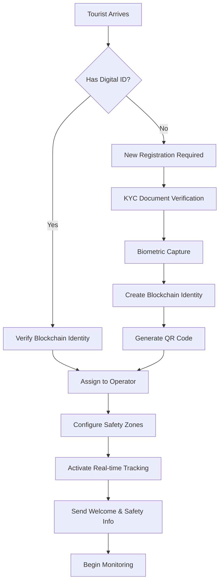

# 🇮🇳 Smart Tourist Safety System - Government Workflow Guide

## 📋 Table of Contents
- [System Overview](#system-overview)
- [Role Hierarchy & Responsibilities](#role-hierarchy--responsibilities)
- [Tourist Registration Flow](#tourist-registration-flow)
- [Emergency Response Procedures](#emergency-response-procedures)
- [Daily Monitoring Tasks](#daily-monitoring-tasks)
- [Inter-Role Coordination](#inter-role-coordination)
- [System Workflows](#system-workflows)
- [Data Flow Architecture](#data-flow-architecture)
- [Standard Operating Procedures](#standard-operating-procedures)

---

## 🎯 System Overview

The Smart Tourist Safety System is a comprehensive government initiative designed to ensure the safety and security of tourists visiting India through advanced technology integration and coordinated response mechanisms.

### 🏗️ Architecture Components
```
┌─────────────────────────────────────────────────────────────┐
│                    SMART TOURIST SAFETY SYSTEM             │
├─────────────────────────────────────────────────────────────┤
│  🔐 Blockchain Identity    📍 Real-time Tracking          │
│  🚨 Emergency Response     📊 Analytics & Insights        │
│  📱 Mobile Integration     🛡️ Government Oversight        │
└─────────────────────────────────────────────────────────────┘
```

---

## 👥 Role Hierarchy & Responsibilities

### 🎖️ **SUPER ADMIN** (Ministry Level)
```
┌─────────────────────────────────────────────┐
│             🏛️ SUPER ADMIN                   │
│          (Ministry of Tourism)              │
├─────────────────────────────────────────────┤
│ 🔧 System Configuration & Management        │
│ 👥 User Role Management                     │
│ 📊 National-level Analytics                 │
│ 🛡️ Security Policy Implementation           │
│ 🌐 Inter-state Coordination                 │
│ 📋 Compliance & Audit Oversight             │
└─────────────────────────────────────────────┘
```

**Key Responsibilities:**
- ✅ Create and manage admin accounts for states
- ✅ Configure system-wide security policies
- ✅ Monitor national tourism safety metrics
- ✅ Coordinate emergency protocols across states
- ✅ Generate national compliance reports

---

### 🎯 **ADMIN** (State/Regional Level)
```
┌─────────────────────────────────────────────┐
│              🏢 ADMIN                       │
│        (State Tourism Department)          │
├─────────────────────────────────────────────┤
│ 👥 Tourist Management                       │
│ 🚨 Operator Assignment & Oversight          │
│ 📍 Zone Configuration                       │
│ 📊 Regional Analytics                       │
│ 🔄 Emergency Coordination                   │
│ 📋 Daily Operations Management              │
└─────────────────────────────────────────────┘
```

**Key Responsibilities:**
- ✅ Register and manage tourists in their region
- ✅ Assign operators to tourist groups
- ✅ Configure geo-fenced safety zones
- ✅ Monitor regional safety metrics
- ✅ Coordinate with local emergency services

---

### 🎧 **OPERATOR** (Field Level)
```
┌─────────────────────────────────────────────┐
│             🚁 FIELD OPERATOR               │
│         (On-ground Safety Personnel)        │
├─────────────────────────────────────────────┤
│ 👤 Individual Tourist Monitoring            │
│ 📍 Real-time Location Tracking              │
│ 🚨 Immediate Emergency Response              │
│ 📞 Direct Tourist Communication             │
│ 📝 Field Incident Reporting                 │
│ 🛡️ Safety Protocol Enforcement              │
└─────────────────────────────────────────────┘
```

**Key Responsibilities:**
- ✅ Monitor assigned tourists (8-12 per operator)
- ✅ Respond to emergency alerts within 3 minutes
- ✅ Conduct safety check-ins every 4 hours
- ✅ Report incidents and safety concerns
- ✅ Provide on-ground assistance

---

### 👁️ **VIEWER** (Analyst Level)
```
┌─────────────────────────────────────────────┐
│               📊 VIEWER                     │
│         (Analytics & Reporting)             │
├─────────────────────────────────────────────┤
│ 📈 Read-only System Access                  │
│ 📊 Data Analysis & Reporting                │
│ 📋 Trend Identification                     │
│ 🔍 Safety Pattern Analysis                  │
│ 📝 Report Generation                        │
│ 📚 Documentation Support                    │
└─────────────────────────────────────────────┘
```

**Key Responsibilities:**
- ✅ Generate safety analytics reports
- ✅ Identify tourism patterns and trends
- ✅ Create data visualizations
- ✅ Support decision-making with insights
- ✅ Monitor system performance metrics

---

## 🚀 Tourist Registration Flow

### 📝 **Registration Process Diagram**


### 📋 **Step-by-Step Process**

#### **Phase 1: Identity Verification** (5-10 minutes)
1. **Document Collection:**
   - 🆔 Government-issued ID (Passport/Aadhaar)
   - 📄 Visa documentation (for international tourists)
   - 📸 Recent photograph
   - 📱 Contact information

2. **Digital Verification:**
   - 🔍 Document authenticity check
   - 🤳 Biometric capture (photo + fingerprint)
   - 🔗 Blockchain identity creation
   - 🎫 QR code generation

#### **Phase 2: System Integration** (2-3 minutes)
1. **Operator Assignment:**
   - 📊 Workload analysis
   - 📍 Geographic proximity
   - 🕒 Shift availability
   - ✅ Automatic assignment

2. **Safety Configuration:**
   - 🗺️ Tourist destination mapping
   - 🚧 Geo-fence setup
   - 📱 Mobile app installation
   - 🚨 Emergency contact setup

---

## 🚨 Emergency Response Procedures

### ⚡ **Emergency Alert Hierarchy**
```
🚨 EMERGENCY DETECTED
          │
          ▼
┌─────────────────────┐
│  AUTO-NOTIFICATION  │
│                     │
│ 🎧 Field Operator   │ ◄── Immediate (0-30 seconds)
│ 🏢 Regional Admin   │ ◄── Within 1 minute
│ 🚔 Local Police     │ ◄── Within 2 minutes
│ 🏥 Medical Services │ ◄── If required
│ 🏛️ Ministry Dashboard│ ◄── For tracking
└─────────────────────┘
```

### 🕐 **Response Timeline Standards**

#### **Tier 1: Critical Emergency** (Life-threatening)
- ⏱️ **0-30 seconds:** Automated alert dispatch
- ⏱️ **30-60 seconds:** Operator acknowledgment required
- ⏱️ **1-3 minutes:** Field response initiated
- ⏱️ **3-5 minutes:** Emergency services contacted
- ⏱️ **5-15 minutes:** On-site assistance arrival

#### **Tier 2: Safety Concern** (Non-critical)
- ⏱️ **0-60 seconds:** Alert generation
- ⏱️ **1-3 minutes:** Operator assessment
- ⏱️ **3-10 minutes:** Direct tourist contact
- ⏱️ **10-30 minutes:** Issue resolution/escalation

#### **Tier 3: Check-in Alert** (Missed check-in)
- ⏱️ **0-15 minutes:** Automated reminder
- ⏱️ **15-30 minutes:** Operator contact attempt
- ⏱️ **30-60 minutes:** Location verification
- ⏱️ **60+ minutes:** Escalate to Tier 2

---

## 📅 Daily Monitoring Tasks

### 🌅 **Morning Operations** (6:00 AM - 12:00 PM)

#### **Super Admin Tasks:**
```
├── 📊 Review overnight incidents (15 min)
├── 📈 Check national system health (10 min)
├── 🗂️ Priority briefings preparation (20 min)
└── 🔄 Cross-state coordination calls (30 min)
```

#### **Admin Tasks:**
```
├── 👥 Operator shift handover review (20 min)
├── 🗺️ Tourist itinerary validation (30 min)
├── 📍 Safety zone status updates (15 min)
├── 🚨 Previous day incident follow-up (25 min)
└── 📊 Daily dashboard preparation (20 min)
```

#### **Operator Tasks:**
```
├── 📱 Tourist check-in status (30 min)
├── 🗺️ Route safety assessment (20 min)
├── 📞 Proactive tourist contact (45 min)
├── 📝 Equipment and system checks (15 min)
└── 🔄 Handover documentation (20 min)
```

### 🌆 **Evening Operations** (6:00 PM - 12:00 AM)

#### **All Roles:**
```
├── 📊 Daily metrics compilation
├── 🚨 Incident documentation
├── 📈 Performance analysis
├── 🔄 Next-day preparation
└── 📋 Handover briefings
```

---

## 🤝 Inter-Role Coordination

### 📊 **Communication Matrix**
```
                   SUPER_ADMIN  ADMIN  OPERATOR  VIEWER
SUPER_ADMIN             ✅      ✅      ✅       ✅
ADMIN                   ✅      ✅      ✅       ✅
OPERATOR                ⚠️      ✅      ✅       ❌
VIEWER                  ❌      ✅      ❌       ✅

✅ = Full Communication Access
⚠️ = Emergency-only Communication
❌ = No Direct Communication
```

### 🔄 **Escalation Protocols**

#### **Standard Escalation Path:**
```
Tourist Issue
     │
     ▼
Field Operator ──────────────────┐
     │                           │
     ▼                           │
Regional Admin ──────────────────┤
     │                           │
     ▼                           ▼
Super Admin ◄───────── Emergency Services
```

#### **Emergency Bypass:**
```
CRITICAL EMERGENCY
        │
        ▼
Parallel Notification
        │
   ┌────┼────┐
   │    │    │
   ▼    ▼    ▼
Operator Admin Police/Medical
```

---

## ⚙️ System Workflows

### 🔄 **Data Synchronization Flow**
```
┌─────────────┐    ┌─────────────┐    ┌─────────────┐
│   Mobile    │◄──►│  Regional   │◄──►│  National   │
│  Devices    │    │  Servers    │    │ Data Center │
└─────────────┘    └─────────────┘    └─────────────┘
       │                   │                   │
       ▼                   ▼                   ▼
 Real-time Data     Regional Analytics   National Reports
 (Every 30 sec)        (Every 5 min)      (Daily/Weekly)
```

### 📱 **Mobile-to-Dashboard Integration**
```
Tourist Mobile App
        │
        ▼ (GPS + Status)
Field Operator Dashboard
        │
        ▼ (Aggregated Data)
Regional Admin Dashboard
        │
        ▼ (Regional Metrics)
National Control Center
```

---

## 📊 Data Flow Architecture

### 🔄 **Real-time Data Pipeline**
```
┌─────────────────────────────────────────────────────────────┐
│                      DATA FLOW PIPELINE                    │
├─────────────────────────────────────────────────────────────┤
│                                                             │
│  📱 Tourist Device → 🛰️ GPS/Cellular → 🌐 Regional Server  │
│       ↓                                        ↓            │
│  📍 Location Data → 🔄 Real-time Processing → 📊 Dashboard  │
│       ↓                                        ↓            │
│  🚨 Alert System → 🎧 Operator Notification → 🚀 Response  │
│                                                             │
└─────────────────────────────────────────────────────────────┘
```

### 💾 **Database Architecture**
```
                    ┌─────────────────┐
                    │  NATIONAL DB    │
                    │   (Master)      │
                    └─────────┬───────┘
                              │
                 ┌────────────┼────────────┐
                 │            │            │
         ┌───────▼─────┐ ┌────▼────┐ ┌────▼────┐
         │ Regional DB │ │ State DB│ │ Local DB│
         │  (North)    │ │ (South) │ │ (East)  │
         └─────────────┘ └─────────┘ └─────────┘
```

---

## 📋 Standard Operating Procedures

### 🎯 **Quality Assurance Standards**

#### **Response Time KPIs:**
- 🚨 **Emergency Response:** < 3 minutes (99.5% target)
- 📞 **Tourist Contact:** < 10 minutes (95% target)
- 📊 **Admin Review:** < 30 minutes (90% target)
- 📈 **Report Generation:** < 24 hours (100% target)

#### **Data Accuracy Standards:**
- 📍 **Location Accuracy:** ±5 meters (GPS)
- 🕐 **Timestamp Precision:** ±1 second
- 📊 **Data Completeness:** 99.9% for critical fields
- 🔄 **Sync Frequency:** Every 30 seconds

### 🛡️ **Security Protocols**

#### **Access Control:**
```
🔐 ROLE-BASED ACCESS CONTROL (RBAC)
├── 🎖️ Super Admin: Full system access
├── 🏢 Admin: Regional management access
├── 🎧 Operator: Assigned tourist access only
└── 👁️ Viewer: Read-only analytics access
```

#### **Data Protection:**
- 🔒 **Encryption:** AES-256 for all data
- 🔐 **Authentication:** Multi-factor required
- 🛡️ **Blockchain:** Immutable identity records
- 📝 **Audit Logs:** Complete action tracking

### 📊 **Performance Monitoring**

#### **System Health Metrics:**
```
┌─────────────────────────────────────────┐
│            SYSTEM DASHBOARD             │
├─────────────────────────────────────────┤
│ 🟢 Active Tourists: 50,247             │
│ 🟢 Online Operators: 4,156             │
│ 🟡 Pending Alerts: 12                  │
│ 🔴 Critical Incidents: 1               │
│                                         │
│ 📊 System Uptime: 99.97%               │
│ ⚡ Avg Response Time: 2.3 minutes       │
│ 📱 App Performance: 98.2%              │
│ 🔄 Data Sync Success: 99.99%           │
└─────────────────────────────────────────┘
```

---

## 🎯 **Success Metrics & Goals**

### 📈 **Key Performance Indicators (KPIs)**

#### **Tourist Safety Metrics:**
- 🎯 **Target:** Zero tourist incidents
- 📊 **Current:** 99.8% incident-free rate
- 🚨 **Emergency Response:** < 3 min average
- 📱 **Tourist Satisfaction:** > 95%

#### **Operational Efficiency:**
- ⚡ **System Uptime:** > 99.9%
- 🎧 **Operator Utilization:** 65-80% optimal
- 📊 **Data Accuracy:** > 99.5%
- 🔄 **Process Automation:** 85% of routine tasks

#### **Government Compliance:**
- 📋 **Audit Readiness:** 100%
- 🛡️ **Security Standards:** ISO 27001 compliant
- 📊 **Reporting Standards:** Real-time availability
- 🔐 **Data Privacy:** GDPR compliant

---

## 🚀 **Future Enhancements**

### 🔮 **Planned Features**
```
🎯 2025 Q1: AI-Powered Predictive Analytics
🎯 2025 Q2: Multilingual Support (12+ languages)
🎯 2025 Q3: IoT Integration (Smart City sensors)
🎯 2025 Q4: Blockchain Smart Contracts
```

### 🌍 **Expansion Roadmap**
```
📅 Phase 1: All major tourist destinations (Complete)
📅 Phase 2: Rural and heritage sites (In Progress)
📅 Phase 3: International coordination (2025)
📅 Phase 4: Regional partnerships (2026)
```

---

## 📞 **Emergency Contacts & Support**

### 🚨 **24/7 Emergency Hotlines**
- 🇮🇳 **National Emergency:** 1800-XXX-XXXX
- 🏥 **Medical Emergency:** 108
- 🚔 **Police Emergency:** 100
- 🔥 **Fire Emergency:** 101

### 💬 **System Support**
- 📧 **Technical Support:** support@touristsafety.gov.in
- 💻 **System Admin:** admin@touristsafety.gov.in
- 📊 **Reports & Analytics:** analytics@touristsafety.gov.in
- 🛡️ **Security Issues:** security@touristsafety.gov.in

---

**Document Version:** v2.1.0  
**Last Updated:** September 17, 2025  
**Next Review:** December 2025  
**Classification:** Official Government Document  

---

*This document contains sensitive operational information. Distribution restricted to authorized government personnel only.*